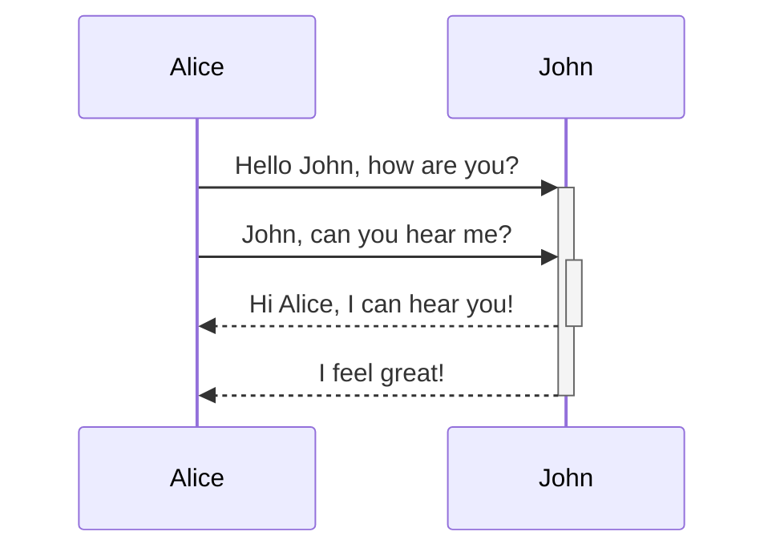
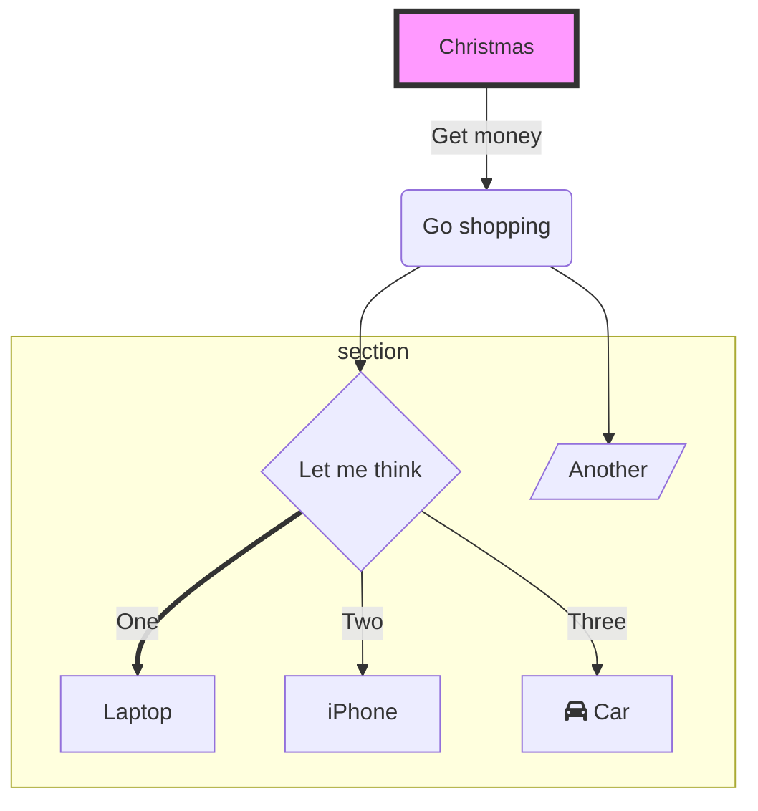

---

title: "Tanglenomicon"
date: "2023-05-05"
tags: [
    "Posters",
]
draft: false
poster:
  highlight_style: dracula
  theme: dracula
  subtitle: "asdfasdf"
  authors: [
    "Joe Starr"
  ]
  asides: [

  ]

---

## Box Name

---

## Box Name

Curabitur elementum tellus mauris, et tristique odio mattis nec. Aenean id pulvinar odio. Phasellus id augue quam. Etiam vel lorem ac lacus molestie dapibus. Vestibulum ullamcorper fringilla mi vel maximus. Etiam maximus laoreet commodo. Duis mollis risus finibus sapien consectetur, ut rutrum eros molestie.

---

## Box Name

Nulla molestie magna sit amet libero sollicitudin, vitae mollis lectus viverra. Fusce rutrum massa vel elementum viverra. Ut aliquet mauris nec malesuada pellentesque. Nulla non odio tempor, tristique libero nec, tincidunt neque. Donec volutpat neque in neque vulputate semper.

---

## Box Name

Maecenas felis lacus, luctus vel lacus ut, finibus vulputate ipsum. Donec pharetra non tellus eget condimentum. Etiam vehicula elementum ipsum sed imperdiet. Proin nibh metus, efficitur vitae est sed, porta posuere dui.
$\lim _{x \rightarrow 8} \frac{x^2-36}{x+6} \times \lim _{x \rightarrow 0} \frac{e^{12 x}-1}{x}+-10 e^{\pi i}$Suspendisse eu lacus nisi. Cras sodales lacus at libero vehicula, sit amet pulvinar mauris consectetur. Mauris vel lorem eget turpis iaculis condimentum sit amet quis diam.

$$
\left(\lim _{x \rightarrow 19} \frac{x^2-100}{x+10}-\left(\cos ^2 x+\sin ^2 x\right)\right)
$$

Nulla quis sagittis nulla, eget tincidunt sem. Suspendisse viverra, orci ut pharetra volutpat, libero mi dictum augue, non dapibus elit massa nec justo. Praesent eu metus efficitur, feugiat urna non, elementum ligula. Curabitur ullamcorper justo nibh, quis ornare odio tristique non.

---

## Box Name

---

## Box Name

Curabitur elementum tellus mauris, et tristique odio mattis nec. Aenean id pulvinar odio. Phasellus id augue quam. Etiam vel lorem ac lacus molestie dapibus. Vestibulum ullamcorper fringilla mi vel maximus. Etiam maximus laoreet commodo. Duis mollis risus finibus sapien consectetur, ut rutrum eros molestie. Nam et eros id risus pretium suscipit ac non velit. Mauris finibus nisl purus, et ullamcorper ipsum vehicula in. Donec non viverra felis.

---

## Box Name

Nulla molestie magna sit amet libero sollicitudin, vitae mollis lectus viverra. Fusce rutrum massa vel elementum viverra. Ut aliquet mauris nec malesuada pellentesque. Nulla non odio tempor, tristique libero nec, tincidunt neque. Donec volutpat neque in neque vulputate semper. Etiam aliquet nulla nec justo condimentum, ornare pretium elit tincidunt. Morbi rutrum et augue non suscipit. Aliquam condimentum lobortis turpis et consequat. Pellentesque in odio vehicula, maximus nunc eget, convallis metus.
