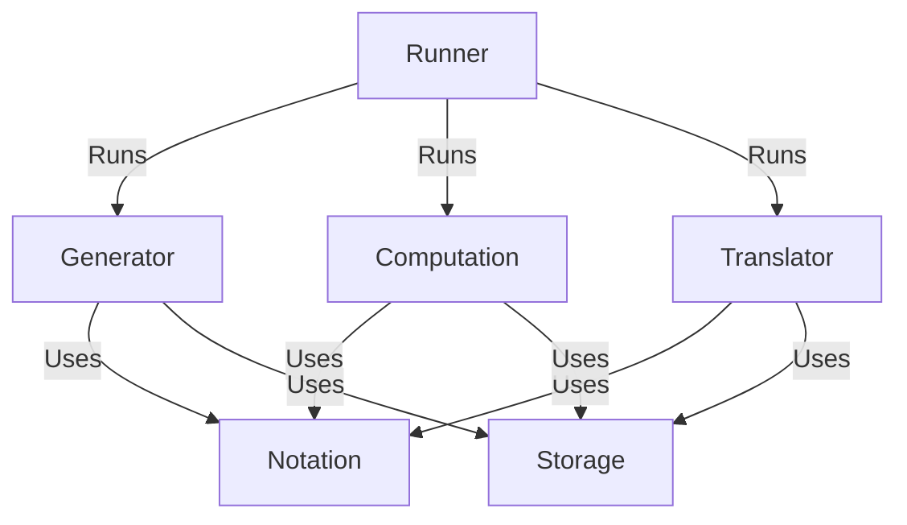

---

title: "Tangled in Knot Theory"
date: "2023-05-10"
summary: "Lightning talk for Tangled in Knot Theory"
tags: [
    "Talks",
]
draft: false

slides:
  highlight_style: dracula
  diagram: true
  diagram_options:
    theme: dark
    themeVariables:
            fontSize: 17
---
<style>
  .tangrow * {
    font-size: 2.5rem;
  }
  .tangrow {
    border: 2px solid var(--r-Red);
    border-radius: 12px;
  }
  .mathbox *{
    font-size: .8rem;
  }
.mermaid svg {
    max-width: none !important;
    width: 100% !important;
    height: auto !important;
}

</style>





<!-- {}
{}
{} -->

## The Tanglenomicon


<p style="font-size:.7em;text-align:center !important">
Zachary Bryhtan, Nicholas Connolly, Isabel Darcy, Ethan Rooke, Joseph Starr*
<p>

<p style="font-size:.6em; text-align:center !important">
Mathematics Department at The University of Iowa<p>


{}
{}

{}
{}

{}
{}

{}
{}

{}
{}


#### Tangle tabulation

```
"The Most Important Missing Infrastructure Project in Knot Theory"

-Dr. Dror Bar-Natan [2012]
```

---

### Classified ✔️

{}
{}

$\circ$

Rational Tangles



[3 2 2]

{}
{}

$$\to$$

{}
{}

$+$

Montesinos Tangles



[3 0 ] + [2 1 0] + [2 2 0]

{}
{}

$$\to$$

{}
{}

$\circ$

Generalized Montesinos Tangles



([3 0] + [3 0] + [2 0]) $\circ$ (1,2)

{}
{}

---


### Not Classified ☹️

{}
{}

$+\ \ast$

  Algebraic Tangles


((([3 2 3] + [3 2 3] ) 0) + (([3 2 3] + [3 2 3] ) 0) 0)

{}
{}

$$\to$$

{}
{}

Non-Algebraic Tangles


{}
{}

---

### Architecture


{}
{{% slides/col style=" max-width: none !important; width:100% !important; " %}}



{}
{}

---

## Sources

{}

- Dror Bar-Natan [The Most Important Missing Infrastructure Project in Knot Theory](http://drorbn.net/AcademicPensieve/2012-01/one/The_Most_Important_Missing_Infrastructure_Project_in_Knot_Theory.pdf)
- Kauffman, L. H., and S. Lambropoulou. "From Tangle Fractions to DNA." In Topology in Molecular Biology, edited by Michail Ilych Monastyrsky, 69-110. Biological and Medical Physics, Biomedical Engineering. Berlin, Heidelberg: Springer Berlin Heidelberg, 2007. [https://doi.org/10.1007/978-3-540-49858-2_5](https://doi.org/10.1007/978-3-540-49858-2_5).
- Moon, Hyeyoung, and Isabel K. Darcy. "Tangle Equations Involving Montesinos Links." Journal of Knot Theory and Its Ramifications 30, no. 08 (July 2021): 2150060. [https://doi.org/10.1142/S0218216521500607](https://doi.org/10.1142/S0218216521500607).
- Conway, J.H. "An Enumeration of Knots and Links, and Some of Their Algebraic Properties." In Computational Problems in Abstract Algebra, 329-58. Elsevier, 1970. [https://doi.org/10.1016/B978-0-08-012975-4.50034-5](https://doi.org/10.1016/B978-0-08-012975-4.50034-5).
- Louis H. Kauffman and Sofia Lambropoulou. Classifying and applying rational knots and rational tangles. In DeTurck, editor, Contemporary Mathematics, volume 304, pages 223-259, 2001

{}
