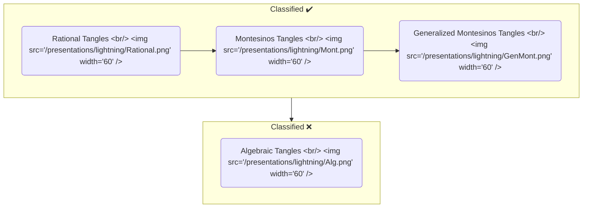

---

title: "Tangled in Knot Theory"
date: "2023-05-10"
summary: "Lightning talk for Tangled in Knot Theory"
tags: [
    "Talks",
]
draft: false

slides:
  highlight_style: dracula
  diagram: true
  diagram_options:
    theme: dark
---




{}
{}
{}

## The Tanglenomicon
### Tangle tabulation

```
"The Most Important Missing Infrastructure Project in Knot Theory"

-Dr. Dror Bar-Natan
```

---

## Building Up




---

### Architecture


{}
{{% slides/col style=" max-width: 80% !important; font-size: 2rem; "%}}


{}
{}

<!-- ---
flowchart LR
    A ~~~ B

## Sources

{}

- Dror Bar-Natan [The Most Important Missing Infrastructure Project in Knot Theory](http://drorbn.net/AcademicPensieve/2012-01/one/The_Most_Important_Missing_Infrastructure_Project_in_Knot_Theory.pdf)
- Kauffman, L. H., and S. Lambropoulou. "From Tangle Fractions to DNA." In Topology in Molecular Biology, edited by Michail Ilych Monastyrsky, 69-110. Biological and Medical Physics, Biomedical Engineering. Berlin, Heidelberg: Springer Berlin Heidelberg, 2007. [https://doi.org/10.1007/978-3-540-49858-2_5](https://doi.org/10.1007/978-3-540-49858-2_5).
- Moon, Hyeyoung, and Isabel K. Darcy. "Tangle Equations Involving Montesinos Links." Journal of Knot Theory and Its Ramifications 30, no. 08 (July 2021): 2150060. [https://doi.org/10.1142/S0218216521500607](https://doi.org/10.1142/S0218216521500607).
- Conway, J.H. "An Enumeration of Knots and Links, and Some of Their Algebraic Properties." In Computational Problems in Abstract Algebra, 329-58. Elsevier, 1970. [https://doi.org/10.1016/B978-0-08-012975-4.50034-5](https://doi.org/10.1016/B978-0-08-012975-4.50034-5).
- Louis H. Kauffman and Sofia Lambropoulou. Classifying and applying rational knots and rational tangles. In DeTurck, editor, Contemporary Mathematics, volume 304, pages 223-259, 2001

{} -->
