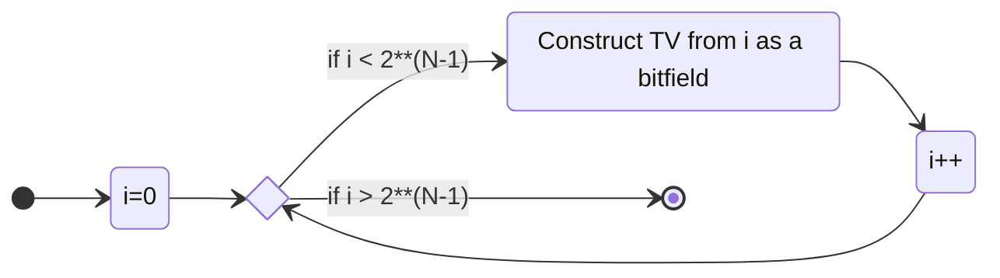
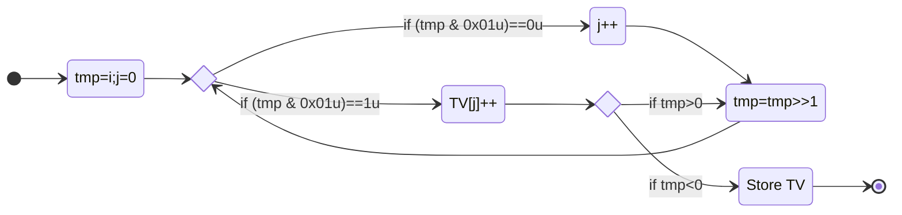
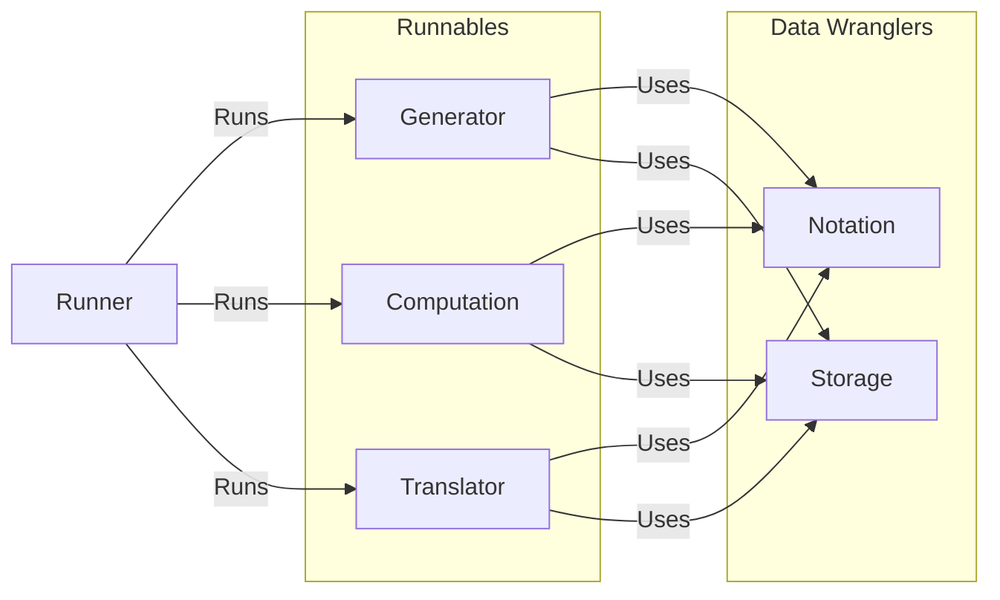





# The Tanglenomicon

Zachary Bryhtan, Nicholas Connolly, Isabel Darcy, Ethan Rooke, Joseph Starr*

Mathematics Department at The University of Iowa

---

# Knots

---

> "A **knot** is a smooth embedding of a circle $S^1$ into Euclidean 3-dimensional space $\R^3$ (or the 3-dimensional sphere $S^3$ )."

{}
Jablan, S., & Sazdanović, R. (2007). Linknot. In Series on Knots and Everything. WORLD SCIENTIFIC. [https://doi.org/10.1142/6623](https://doi.org/10.1142/6623)
{}

---








$\quad$







$\quad$







$\quad$








{}
[https://www.knotplot.com/](https://www.knotplot.com/)
{}

---

# Knot Equivalence

---

# reidemeister moves

---
# Type I







$\to$







---
# Type II







$\to$







---
# Type III







$\to$







---

# The natural question

---
# Knot Tables

---






Lord Kelvin's vortex theory of the atom. Atoms are knotted vortices in the æther.




---

* 1860's Tait computes knots up to 7 crossing
   * 15 knots
* 1870's Tait, Kirkman, and Little compute knots up to 10 crossing
   * Takes about 25 years
   * 250 knots
* 1960's Conway computes knots up to 11 crossings
   * "A few hours"
   * 802 knots

---

* 1980's Dowker and Thistlethwaite compute up to 13 crossings
    * First using a computer
    * 12,966
* 1990's Hoste, Thistlethwaite, and Weeks compute up to 16 crossings
    * Computer runtime on the order of weeks
    * 1,701,936
* 2020's Burton computes up to 19 crossings
    * 350 Million

---

{}

### KnotInfo



---

## Conway

How did Conway compute 25 years of work in "a few hours"?

---

## Tangles

> "We define a **tangle** as a portion of a knot diagram from which there emerge just 4 arcs pointing in the compass directions NW, NE, SW, SE."

{}
Conway, J.H. "An Enumeration of Knots and Links, and Some of Their Algebraic Properties." In Computational Problems in Abstract Algebra, 329-58. Elsevier, 1970. [https://doi.org/10.1016/B978-0-08-012975-4.50034-5](https://doi.org/10.1016/B978-0-08-012975-4.50034-5)
{}

---








$\quad$







$\quad$








___






$\quad$





$\quad$





$\quad$






---

# Basic Operations

---

## Operation $+$









$+$









$=$









$=$









$=$




$2$




---

## Operation $\vee$









$\vee$









$=$









$=$









$=$




$2$




---

# The Tanglenomicon

---

{}

## Building up









$\ $







$\ $
















$\ $







$\ $










---

# Where we are

---

# Rational Tangles

---

{}



---

{}







$\ $



$\begin{aligned}\to&\ \LP 3 \vee \frac{1}{2}\RP + 2\\&\\
\to&\ [3\ 2\ 2]\end{aligned}$





---

# Generation

---

For any $N$ an obvious twist vector is the twist vector of all $1$s
$$[1\ 1\ 1\ \cdots\ 1]$$
Noting that when we write this sequence we have $N-1$ spaces.

---

If we choose to place a $+$ instead of the left most space we get
$$[1+1\ 1\ \cdots\ 1]=[2\ 1\ \cdots\ 1]$$
we're free to make this choice for each space

---

this gives $N-1$ choices between '$+$' and space
$$[1\square 1\square 1\square\cdots\square1]$$
letting us generate twist vectors by simply counting from $0\to 2^{N-1}$.

---



$$\begin{array}{|l|l|l|l|}
\hline
[1\ 1\ 1\ 1\ 1]\ &\ [2\ 1\ 1\ 1]\ &\ [1\ 2\ 1\ 1]\ &\ [1\ 1\ 2\ 1]\\\hline
[1\ 1\ 1\ 2]\ &\ [3\ 1\ 1]\ &\ [1\ 3\ 1]\ &\ [1\ 1\ 3]\\\hline
[2\ 2\ 1]\ &\ [2\ 1\ 2]\ &\ [1\ 2\ 2]\ &\ [3\ 2]\\\hline
[2\ 3]\ &\ [4\ 1]\ &\ [1\ 4]\ &\ [5]\\\hline
\end{array}$$



---

<!-- {} -->

## Canonical Twist Vectors

We can write a *canonical twist vector* by taking the odd length vectors, appending $0$ where needed.

<!-- @@@TODO: Pictures -->

---


$$
\begin{array}{|c|c|c|c|}
\hline
[1\ 1\ 1\ 1\ 1]\ &\ [2\ 1\ 1\ 1\ 0]\ &\ [1\ 2\ 1\ 1\ 0]\ &\ [1\ 1\ 2\ 1\ 0]\\\hline
[1\ 1\ 1\ 2\ 0]\ &\ [3\ 1\ 1]\ &\ [1\ 3\ 1]\ &\ [1\ 1\ 3]\\\hline
[2\ 2\ 1]\ &\ [2\ 1\ 2]\ &\ [1\ 2\ 2]\ &\ [3\ 2\ 0]\\\hline
[2\ 3\ 0]\ &\ [4\ 1\ 0]\ &\ [1\ 4\ 0]\ &\ [5]\\\hline
\end{array}
$$


---

# Programmatic Description

---

---

## Construct TV from i as a bitfield

---

# Computations

---

## Rational Number (continued fraction)

The rational number for a twist vector is computed by taking the twist vector as a finite continued fraction that is:
$$\LB a\ b\ c\RB=c+\frac{1}{b+\frac{1}{a}}$$









$$\ =\LB 3\ 2\ 2\RB=2+\frac{1}{2+\frac{1}{3}}=\frac{17}{7}$$






{}
Louis H. Kauffman and Sofia Lambropoulou. Classifying and applying rational knots and rational tangles. In DeTurck, editor, Contemporary Mathematics, volume 304, pages 223-259, 2001
{}

---

To play with twist vectors and continued fractions visit



https://joe-starr.com/resources/cont_frac_convert/

---
<!--

## Parity

@@@TODO

---
## Closures

{}
{}
### Numerator

{}
{}
### Denominator
@@@TODO
{}
{}

---
## Closure Equivlance and pivoting to knots

@@@TODO

---
 -->

# Where we're going

---

# Montesinos

---

{}



---
## Existence of canonical diagrams for Montesinos tangles

Every non-rational Montesinos tangle $T$ admits a canonical diagram satisfying one of the following constructions for horizontal and vertical Montesinos tangles, respectively.

1. $T \cong L_1+\cdots+L_m+\frac{k}{1}$, where each $L_i \cong \frac{p_i}{q_i}$ is a rational subtangle in canonical form with fraction satisfying $0<\frac{p_i}{q_i}<1$, and $\frac{k}{1}$ is a horizontal integer subtangle.
2. $T \cong L_1 * \cdots * L_m * \frac{1}{k}$, where each $L_i \cong \frac{p_i}{q_i}$ is a rational subtangle in canonical form with fraction satisfying $-\infty<\frac{p_i}{q_i}<-1$, and $\frac{1}{k}$ is a vertical integer subtangle.

{}
Jos ́e M. Montesinos. Seifert manifolds that are ramified two-sheeted cyclic coverings. Bol. Soc. Mat. Mexicana (2), 18:1-32, 1973.
{}

---









$+$









$=$









---









$$\ =\ $$









$$=[3\  2\  2] + [3\  2\  2]$$




---

# Generation

The Montesinos tangles of crossing number $N$ have a slightly simpler generation strategy compared to rational tangles.

We again generate stencils (twist vectors ) but require that each entry satisfies $2\leq e < \N$.


\begin{array}{|l|l|l|l|}
\hline
[2\ 3]\ &\ [3\ 2]\\\hline
\end{array}


---

Now for each entry $e_i$ of the stencil we generate a list of rational tangles of crossing number equal to $e_i$, with the restriction $0<\frac{p_i}{q_i}<1$. We then take all combinations of elements of these lists.


\begin{array}{|l|l|}
\hline
\color{var(--r-Purple)}\text{Stencil:}[3\ 2]\ &\ \\\hline
\color{var(--r-Foreground)}[1\ 2\ 0] + [1\ 1\ 0]\ &\ [2\ 1\ 0] + [1\ 1\ 0]\\\hline
\color{var(--r-Purple)}\text{Stencil:}[2\ 3]\\\hline
\color{var(--r-Foreground)}[1\ 1\ 0] + [1\ 2\ 0]\ &\ [1\ 1\ 0] + [2\ 1\ 0]\\\hline
\end{array}


<!--
---
# Data

---
## Internal Loops

@@@TODO:

 -->

---
# Generalized Montesinos
---
{}



---

### Operation $\circ$







$\ $



$= \color{var(--r-Purple)}([3\  0] + [3\  0] + [2\  0]) \color{var(--r-Foreground)}\circ \color{var(--r-Red)}[1\  2]$





---

# Generation

---

We just need to take our lists of Montesinos and rational and glue them together with $\circ$.

---

# Into the future
---

## Algebraic

---



---

All possible tangles made from $+$ and $\vee$



{}
{}

{}
{}
A vertical sum of two Montesinos tangles.
{}
{}

{}
{}


---
# Generation

---

## Caudron Trees

To generate all possible rational tangles we can generate all possible algebraic expressions on the trivial tangles.

This boils down to all binary trees on $N$ leaves. With nodes labeled with combinations of $\vee$ and $+$ and leaves labeled with all combinations of trivial tangles.

These binary trees are call Caudron Trees.

{}
Alain Caudron. Classification des nœuds et des enlacements, volume 4 of Publications Math ́ematiques d'Orsay 82 [Mathematical Publications of Orsay 82]. Universit ́e de ParisSud, D ́epartement de Mathe  ́matique, Orsay, 1982.
{}

<!--

---
## Generation
@@@TODO:
 -->

---
# Non-algebraic/Polygonal
---


---

## 4-valent planar graphs






$\quad$






---

# 4-valent planar graph insertions

---



---

# Generation

There exist tables of 4 valent graphs. We can use those with insertions from our list of algebraic tangles to generate all polygonal tangles.

---

# Tooling

---

# Design Goals

---

# Technologies

* FastAPI
* MongoDB
* React
* Obsidian
* Mermaid
* Unity unit tests
* Pytest

---

# Languages

* C
* C++
* Python

---
<!--
### Runners
---

### Database
---

### API
---

 -->
# WebTech



---

### Sources

{}

1. Dror Bar-Natan [The Most Important Missing Infrastructure Project in Knot Theory](http://drorbn.net/AcademicPensieve/2012-01/one/The_Most_Important_Missing_Infrastructure_Project_in_Knot_Theory.pdf)
2. Kauffman, L. H., and S. Lambropoulou. "From Tangle Fractions to DNA." In Topology in Molecular Biology, edited by Michail Ilych Monastyrsky, 69-110. Biological and Medical Physics, Biomedical Engineering. Berlin, Heidelberg: Springer Berlin Heidelberg, 2007. [https://doi.org/10.1007/978-3-540-49858-2_5](https://doi.org/10.1007/978-3-540-49858-2_5).
3. Moon, Hyeyoung, and Isabel K. Darcy. "Tangle Equations Involving Montesinos Links." Journal of Knot Theory and Its Ramifications 30, no. 08 (July 2021): 2150060. [https://doi.org/10.1142/S0218216521500607](https://doi.org/10.1142/S0218216521500607).
4. Conway, J.H. "An Enumeration of Knots and Links, and Some of Their Algebraic Properties." In Computational Problems in Abstract Algebra, 329-58. Elsevier, 1970. [https://doi.org/10.1016/B978-0-08-012975-4.50034-5](https://doi.org/10.1016/B978-0-08-012975-4.50034-5).
5. Louis H. Kauffman and Sofia Lambropoulou. Classifying and applying rational knots and rational tangles. In DeTurck, editor, Contemporary Mathematics, volume 304, pages 223-259, 2001
6. Alain Caudron. Classification des nœuds et des enlacements, volume 4 of Publications Math ́ematiques d'Orsay 82 [Mathematical Publications of Orsay 82]. Universit ́e de ParisSud, D ́epartement de Mathe  ́matique, Orsay, 1982.
7. Robert Glenn Scharein. Interactive topological drawing. ProQuest LLC, Ann Arbor, MI, 1998. Thesis (Ph.D. The University of British Columbia (Canada). URL: [https://www.knotplot.com/](https://www.knotplot.com/).
8. Jablan, S., & Sazdanović, R. (2007). Linknot. In Series on Knots and Everything. WORLD SCIENTIFIC. [https://doi.org/10.1142/6623](https://doi.org/10.1142/6623)
9. Dowker, C. H., & Thistlethwaite, M. B. (1983). Classification of knot projections. In Topology and its Applications (Vol. 16, Issue 1, pp. 19-31). Elsevier BV. [https://doi.org/10.1016/0166-8641(83)90004-4](https://doi.org/10.1016/0166-8641(83)90004-4)
10. Hoste, J., Thistlethwaite, M., & Weeks, J. (1998). The first 1,701,936 knots. In The Mathematical Intelligencer (Vol. 20, Issue 4, pp. 33-48). Springer Science and Business Media LLC. [https://doi.org/10.1007/bf03025227](https://doi.org/10.1007/bf03025227)
11. Burton, B. A. (2020). The Next 350 Million Knots. Schloss Dagstuhl - Leibniz-Zentrum Für Informatik. [https://doi.org/10.4230/LIPICS.SOCG.2020.25](https://doi.org/10.4230/LIPICS.SOCG.2020.25)
12.  C. Livingston and A. H. Moore, KnotInfo: Table of Knot Invariants, knotinfo.math.indiana.edu, today's date (eg. August 24, 2023).
{}

{}

{}

