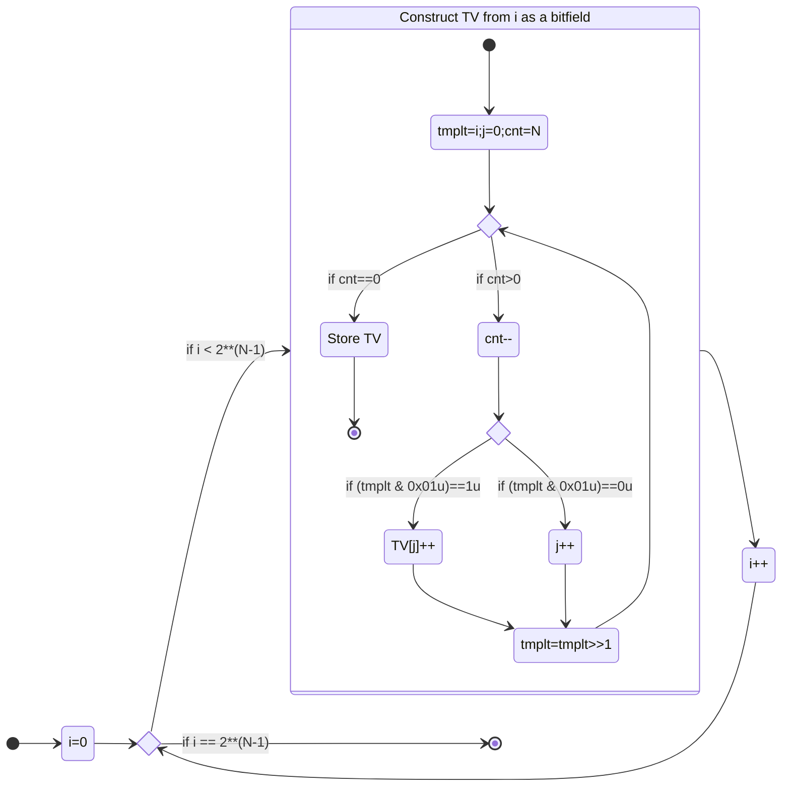
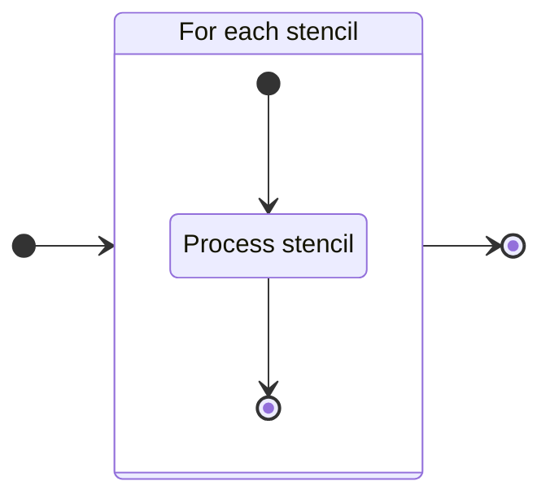
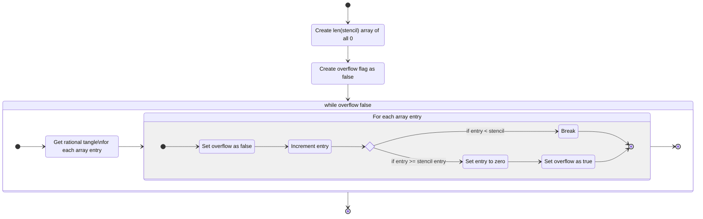
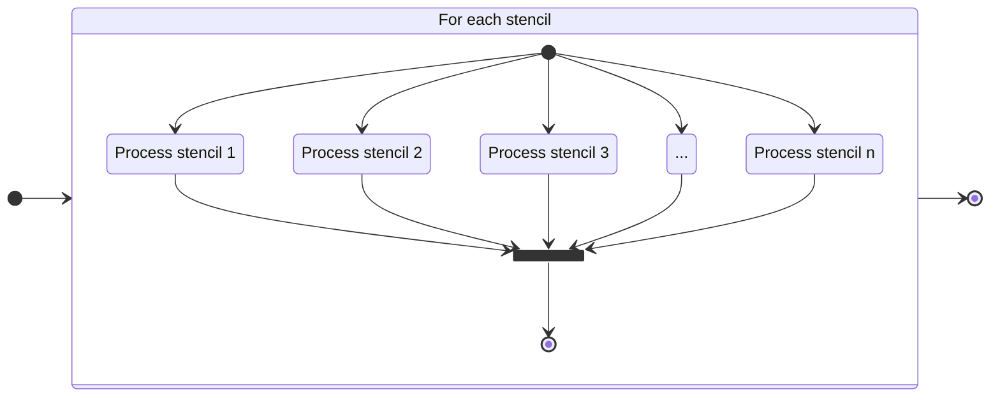
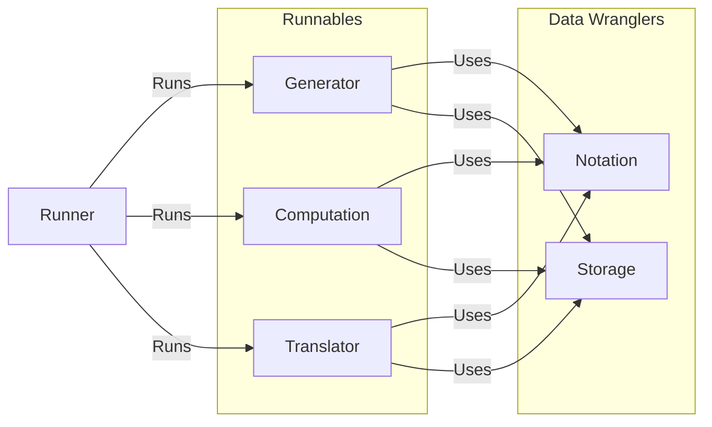






<style>

.mjx-n div svg{
    width:4.8 rem;
    height:auto;
    margin-left:-.5rem;
    margin-top:-1rem;
}

#qr {
    width:35rem;
    height:35rem;
    margin-left: auto !important;
    margin-right: auto !important;
}
#tech_img {
    width:30vw;
    height:auto;
    margin-left: auto !important;
    margin-right: auto !important;
}
#parity_1,#parity_2,#parity_3,#parity_4,#parity_5,#parity_6{
    width:18rem;
    height:18rem;
    margin-left: auto !important;
    margin-right: auto !important;
}
#parity_calc_1,#parity_calc_2{
    width :12rem;
    height:12rem;
    margin-left: auto !important;
    margin-right: auto !important;
}
#non_alg{
    width :35rem;
    height:35rem;
    margin-left: auto !important;
    margin-right: auto !important;
}
#alg_trees_nonunique{
    width :40vw;
    margin-left: auto !important;
    margin-right: auto !important;
}
#band_sum_1,#band_sum_2{
    width:40vw;
    margin-bottom: 5vh;
    margin-left: auto !important;
    margin-right: auto !important;
}
#mermaid-0{
    width:auto !important;
    height:auto !important;
    max-width:80vw !important;
    max-height:60vh !important;
}
#mermaid-0 svg{
    max-width:80vw !important;
    max-height:60vh !important;
}
#mermaid-1 svg{
    width:30vw;
}
#mermaid-2 {
    max-width:none !important;
    max-height:none !important;
    margin-left:-8rem;
}
#mermaid-2 svg{
    width:65vw !important;
    height:65vh !important;
    max-width:none !important;
    max-height:none !important;
}
#mermaid-3 svg{
    width:90vw;
}
#mermaid-4 svg{
    width:30vw;
}
a.lowercase {
  text-transform: lowercase;
}

</style>

## Comprehensive Exam (8/19/24)

# The Tanglenomicon


<p style="font-size:.7em;text-align:center !important">
Zachary Bryhtan, Nicholas Connolly, Isabel Darcy, Ethan Rooke, Joseph Starr*
<p>

<p style="font-size:.6em; text-align:center !important"> Mathematics Department at The University of Iowa<p>


---

# Knots

---








$\quad$







$\quad$







$\quad$








{}
[https://www.knotplot.com/](https://www.knotplot.com/)
{}


---

# The natural question

## How many knots?

---
# Knot Tables

---

### Lord Kelvin's vortex theory of the atom







Atoms are knotted vortices in the æther.




---

# By Hand

* 1860's Tait computes knots up to 7 crossings
   * 15 knots
* 1870's Tait, Kirkman, and Little compute knots up to 10 crossings
   * Takes about 25 years
   * 250 knots
* 1960's Conway computes knots up to 11 crossings
   * "A few hours"
   * 802 knots

---

# By Computer

* 1980's Dowker and Thistlethwaite compute up to 13 crossings
    * First using a computer
    * 12,966 knots
* 1990's Hoste, Thistlethwaite, and Weeks compute up to 16 crossings
    * Computer runtime on the order of weeks
    * 1,701,936 knots
* 2020's Burton computes up to 19 crossings
    * 350 Million knots

---

{}

### KnotInfo




{}
 C. Livingston and A. H. Moore, KnotInfo: Table of Knot Invariants, [https://knotinfo.math.indiana.edu/](https://knotinfo.math.indiana.edu/), today's date (eg. August 24, 2023)
{}

---

## Conway


How did Conway compute 25 years of work in "a few hours"?


---

## Tangles

> "We define a **tangle** as a portion of a knot diagram from which there emerge just 4 arcs pointing in the compass directions NW, NE, SW, SE." - Conway, J.H.

{}
Conway, J.H. "An Enumeration of Knots and Links, and Some of Their Algebraic Properties." In Computational Problems in Abstract Algebra, 329-58. Elsevier, 1970. [https://doi.org/10.1016/B978-0-08-012975-4.50034-5](https://doi.org/10.1016/B978-0-08-012975-4.50034-5)
{}

---








$\quad$







$\quad$








___







$\quad$





$\quad$





$\quad$






---

# Basic Operations

---

## Operation $+$










$+$









$=$









$=$









$=$




$2$





---

## Operation $\vee$










$\vee$









$=$









$=$









$=$




$\frac{1}{2}$




---

# The Tanglenomicon
## A table of two string tangles
### (up to fixed boundary)


---

{}

## Building up









$\ $







$\ $
















$\ $







$\ $











---

# Where we are

---


# Rational Tangles

---

{}




---

{}







$\ $



$\begin{aligned}\to&\ \LP 3 \vee \frac{1}{2}\RP + 2\\&\\
\to&\ [3\ 2\ 2]\end{aligned}$





---




    


    
    $\begin{aligned}\to&\ \LP 1 \vee \frac{1}{3}\RP + 1\\&\\
    \to&\ [1\ 3\ 1]\end{aligned}$
    


$\ $


    


    
    $\begin{aligned}\to& \frac{1}{4} + 1\,\,\\&\\
    \to&\ [4\ 1]\end{aligned}$
    



---

# Generation

---

For any $N$ an obvious twist vector is the twist vector of all $1$s
$$[1\ 1\ 1\ \cdots\ 1]$$
Noting that when we write this sequence, we have $N-1$ spaces.

---

If we choose to place a $+$ instead of the left most space we get
$$[1+1\ 1\ \cdots\ 1]=[2\ 1\ \cdots\ 1]$$
we're free to make this choice for each space

---

this gives $N-1$ choices between '$+$' and space
$$[1\square 1\square 1\square\cdots\square1]$$
letting us generate twist vectors by simply counting from $0\to 2^{N-1}$.



$$\begin{array}{|l|l|l|l|}
\hline
[1\ 1\ 1\ 1\ 1]\ &\
[1\ 1\ 1\ 2]\ &\
[1\ 1\ 2\ 1]\ &\
[1\ 1\ 3]\\\hline
[1\ 2\ 1\ 1]\ &\
[1\ 2\ 2]\ &\
[1\ 3\ 1]\ &\
[1\ 4]\\\hline
[2\ 1\ 1\ 1]\ &\
[2\ 1\ 2]\ &\
[2\ 2\ 1]\ &\
[2\ 3]\\\hline
[3\ 1\ 1]\ &\
[3\ 2]\ &\
[4\ 1]\ &\
[5]\\\hline
\end{array}$$



---

# Programmatic Description

---








|      i      |     tmplt  |     cnt    |      j     |     tv      |
| ----------- | ---------- | ---------- | ---------- | ----------- |
|      0      |   0000     |     5      |      0     | [1,1,1,1,1] |
|      0      |   0000     |     4      |      1     | [1,1,1,1,1] |
|      0      |   0000     |     3      |      2     | [1,1,1,1,1] |
|      0      |   0000     |     2      |      3     | [1,1,1,1,1] |
|      0      |   0000     |     1      |      4     | [1,1,1,1,1] |
|      0      |   0000     |     0      |      4     | [1,1,1,1,1] |

|      i      |     tmplt  |     cnt    |      j     |     tv      |
| ----------- | ---------- | ---------- | ---------- | ----------- |
|      6      |   0110     |     5      |      4     | [1,1,1,1,1] |
|      6      |   0011     |     4      |      1     | [1,1,1,1,1] |
|      6      |   0001     |     3      |      1     | [1,2,1,1,1] |
|      6      |   0000     |     2      |      1     | [1,3,1,1,1] |
|      6      |   0000     |     1      |      2     | [1,3,1,1,1] |
|      6      |   0000     |     0      |      2     | [1,3,1,1,1] |

|      i      |     tmplt  |     cnt    |      j     |     tv      |
| ----------- | ---------- | ---------- | ---------- | ----------- |
|      7      |   0111     |     5      |      0     | [1,1,1,1,1] |
|      7      |   0011     |     4      |      0     | [2,1,1,1,1] |
|      7      |   0001     |     3      |      0     | [3,1,1,1,1] |
|      7      |   0000     |     2      |      0     | [4,1,1,1,1] |
|      7      |   0000     |     1      |      1     | [4,1,1,1,1] |
|      7      |   0000     |     0      |      1     | [4,1,1,1,1] |




---


## Canonical Twist Vectors

We can write a *canonical twist vector* by taking the odd length vectors (appending $0$ where needed).



$$\begin{array}{|l|l|l|l|}
\hline
[1\ 1\ 1\ 1\ 1]\ &\
[1\ 1\ 1\ 2\ 0]\ &\
[1\ 1\ 2\ 1\ 0]\ &\
[1\ 1\ 3]\\\hline
[1\ 2\ 1\ 1\ 0]\ &\
[1\ 2\ 2]\ &\
[1\ 3\ 1]\ &\
[1\ 4\ 0]\\\hline
[2\ 1\ 1\ 1\ 0]\ &\
[2\ 1\ 2]\ &\
[2\ 2\ 1]\ &\
[2\ 3\ 0]\\\hline
[3\ 1\ 1]\ &\
[3\ 2\ 0]\ &\
[4\ 1\ 0]\ &\
[5]\\\hline
\end{array}$$




---

# Computations

---

## Rational Number (continued fraction)


The rational number for a twist vector is computed by taking the twist vector as a finite continued fraction, that is:
$$\LB a\ b\ c\RB=c+\frac{1}{b+\frac{1}{a}}$$









$$\ =\LB 3\ 2\ 2\RB=2+\frac{1}{2+\frac{1}{3}}=\frac{17}{7}$$







{}
* J.R. Goldman, L.H. Kauffman, Rational Tangles, Advances in Applied Math., 18 (1997), 300-332.
* Conway, J.H. "An Enumeration of Knots and Links, and Some of Their Algebraic Properties." In Computational Problems in Abstract Algebra, 329-58. Elsevier, 1970. [https://doi.org/10.1016/B978-0-08-012975-4.50034-5](https://doi.org/10.1016/B978-0-08-012975-4.50034-5)

{}

---

To play with twist vectors and continued fractions, visit:



<p style="text-align:center !important;">https://joe-starr.com/resources/cont_frac_convert/</p>


---

## Parity


    
        
            
                
            
        
        
            
                
            
        
    
    
        
            
                
            
        
        
            
                
            
        
    
    
        
            
                
            
        
        
            
                
            
        
    


---

## Computing Parity

If we take the rational number $\frac{p}{q}$ associated with the rational tangle we get the following correspondence for parity




$\begin{array}{|c|c|c|c|}
\hline
p\ \%\ 2 &q\ \%\ 2&\text{Parity}\\ \hline
0 &0&N/A&\\ \hline
0 &1& 0 & \img{/presentations/comp/0.svg}\\ \hline
1 &0&\infty& \img{/presentations/comp/inf.svg}\\ \hline
1 &1& 1& \img{/presentations/comp/parity_1.svg}\\ \hline
\end{array}$




{}
Louis H. Kauffman and Sofia Lambropoulou. Classifying and applying rational knots and rational tangles. In DeTurck, editor, Contemporary Mathematics, volume 304, pages 223-259, 2001
{}

---

















$$\ =[3\ 2\ 1]=1+\frac{1}{2+\frac{1}{3}}=\frac{10}{7}\to\text{ Parity: 0 }$$

















---

## Closures






$\ $






---
## Closure Equivalence and pivoting to knots



 Suppose that rational tangles with fractions $\frac{p}{q}$ and $\frac{p^{\prime}}{q^{\prime}}$ are given ( $p$ and $q$ are relatively prime and $0&lt;p$. Similarly for $p^{\prime}$ and $q^{\prime}$). If $N\left(\frac{p}{q}\right)$ and $N\left(\frac{p^{\prime}}{q^{\prime}}\right)$ denote the corresponding rational knots obtained by taking numerator closures of these tangles, then $N\left(\frac{p}{q}\right)$ and $N\left(\frac{p^{\prime}}{q^{\prime}}\right)$ are topologically equivalent if and only if
<br/>
(1) $p=p^{\prime}$
<br/>
(2) either $q \equiv q^{\prime}(\bmod p)$ or $q q^{\prime} \equiv 1(\bmod p)$.



{}
Schubert, Horst. "Knoten mit zwei Brücken.." Mathematische Zeitschrift 65 (1956): 133-170. [http://eudml.org/doc/169591](http://eudml.org/doc/169591).
{}

---





---

# Montesinos

---
{}



---


{}




---
## Existence of canonical diagrams for Montesinos tangles


Every non-rational Montesinos tangle $T$ admits a canonical diagram satisfying the following construction:
$$T \cong L_1+\cdots+L_m+\frac{k}{1}$$ where each $L_i \cong \frac{p_i}{q_i}$ is a rational subtangle in canonical form with fraction satisfying $0<\frac{p_i}{q_i}<1$, and $\frac{k}{1}$ is a horizontal integer subtangle.


{}
F. Bonahon and L. Siebenmann, New geometric splittings of classical knots, and the classification and symmetries of arborescent knots, [http://www-bcf.usc.edu/~fbonahon/Research/Publications.html](http://www-bcf.usc.edu/~fbonahon/Research/Publications.html)
{}

---









$+$









$=$









---










$$\ =\ $$









$$=[3\  2\ 0] + [3\  2\  0]$$




---

# Generation

For Montesinos tangles of crossing number $N$ we start by again generating
twist vectors, however we require that each entry $e$ of the twist vector
satisfies $2\leq e < N.$

We call these restricted set of twist vectors *stencils*.


$$\begin{array}{|l|l|l|l|}
\hline
[1\ 1\ 1\ 1\ 1]\ &\ [2\ 1\ 1\ 1]\ &\ [1\ 2\ 1\ 1]\ &\ [1\ 1\ 2\ 1]\\\hline
[1\ 1\ 1\ 2]\ &\ [3\ 1\ 1]\ &\ [1\ 3\ 1]\ &\ [1\ 1\ 3]\\\hline
[2\ 2\ 1]\ &\ [2\ 1\ 2]\ &\ [1\ 2\ 2]\ &\ [3\ 2]\\\hline
[2\ 3]\ &\ [4\ 1]\ &\ [1\ 4]\ &\ [5]\\\hline
\end{array}$$


---


Now for each entry $e_i$ of the stencil, we generate a list of rational tangles
of crossing number equal to $e_i$, with the restriction $0<\frac{p_i}{q_i}<1$.
We then take all combinations of elements of these lists.




\begin{array}{|l|}
\hline
\text{Rational Tangles CN: }2  \\\hline
[1\ 1\ 0]=\frac{1}{2},\ [2]=\frac{2}{1}  \ \\\hline
\text{Rational Tangles CN: }3\\\hline
[1\ 2\ 0]=\frac{1}{3},\ [2\ 1\ 0]=\frac{2}{3},\ [3]=\frac{3}{1}\\\hline
\end{array}


$\quad$


\begin{array}{|l|l|}
\hline
\color{var(--r-Purple)}\text{Stencil:}[3\ 2]\ &\ \\\hline
\color{var(--r-Foreground)}[1\ 2\ 0] + [1\ 1\ 0]\ &\ [2\ 1\ 0] + [1\ 1\ 0]\\\hline
\color{var(--r-Purple)}\text{Stencil:}[2\ 3]\\\hline
\color{var(--r-Foreground)}[1\ 1\ 0] + [1\ 2\ 0]\ &\ [1\ 1\ 0] + [2\ 1\ 0]\\\hline
\end{array}




---

## What about the '<a class="lowercase" style="color:var(--r-Blue)">k</a>'?

The construction for the canonical Montesinos tangles includes a trailing
$\frac{k}{1}$ tangle. Our generation strategy seems to miss these.

What we're actually generating with this algorithm is Montesinos tangles up to
moveable boundary components of the tangle. To recover fixed boundary tangles we
can append an integral $k$ summand to each lower crossing Montesinos tangle with
a circle product (more to come).

---

{}

# Programmatic Description


---

{}



---


---

# Using The Tanglenomicon
## Alpha

---



---



---

To play with a live version, visit:


<p style="text-align:center !important;">https://tanglenomicon.com</p>

---

# Where we're going

---
# Generalized Montesinos

---
{}



---
{}




---

### Operation $\circ$







$\ $



$= \color{var(--r-Purple)}([1\ 2\  0] + [1\ 2\ 0] + [1\ 1\  0]) \color{var(--r-Foreground)}\circ \color{var(--r-Red)}[2\  2]$






{}
Moon, Hyeyoung, and Isabel K. Darcy. "Tangle Equations Involving Montesinos Links." Journal of Knot Theory and Its Ramifications 30, no. 08 (July 2021): 2150060. [https://doi.org/10.1142/S0218216521500607](https://doi.org/10.1142/S0218216521500607).
{}

---

# Generation


We just need to take our lists of Montesinos and rational tangles and glue them together with $\circ$.







$\ $



$= \color{var(--r-Purple)}([1\ 2\  0] + [1\ 2\ 0] + [1\ 1\  0]) \color{var(--r-Foreground)}\circ \color{var(--r-Red)}[2\  2]$





---

## Algebraic

---

{}



---
{}




---

All possible tangles made from $+$ and $\vee$ on basic tangles








A tangle build from $\vee$ and $+$ on some rational tangles.








$$\LP\color{var(--r-Purple)}\LB3\ 2\ 3\RB+\LB3\ 2\ 3\RB\color{var(--r-Foreground)}\RP\vee\LP\color{var(--r-Purple)}\LB3\ 2\ 3\RB+\LB3\ 2\ 3\RB\color{var(--r-Foreground)}\RP$$





---
# Generation
## A tale of two strate-trees

---

# strate-tree 1
## Algebraic Tangle Trees
---

As we saw, we can linearize any algebraic tangle as:

$$\LP\LB3\ 2\ 3\RB+\LB3\ 2\ 3\RB\RP\vee\LP\LB3\ 2\ 3\RB+\LB3\ 2\ 3\RB\RP$$

How do we programmatically generate tangles from this?

---

{}

$$\LP\LB3\ 2\ 3\RB+\LB3\ 2\ 3\RB\RP\vee\LP\LB3\ 2\ 3\RB+\LB3\ 2\ 3\RB\RP$$


---

We can generate all possible algebraic expressions involving the basic tangles
and twist vector of rational tangles.

Equivalently, all full binary trees with $N$ leaves. Where the tree's internal
nodes are labeled with combinations of $\vee$ and $+$ and leaves are labeled
with all combinations of basic tangles or the twist vector of rational tangles.

We call these binary trees *Algebraic Tangle Trees*.

{}
* Alain Caudron. Classification des nœuds et des enlacements, volume 4 of Publications Math ́ematiques d'Orsay 82 [Mathematical Publications of Orsay 82]. Universit ́e de ParisSud, D ́epartement de Mathe  ́matique, Orsay, 1982.
* Connolly, Nicholas. Classification and Tabulation of 2-String Tangles: The Astronomy of Subtangle Decompositions. University of Iowa, 2021, https://doi.org/10.17077/etd.005978.
{}

---
# A problem




---

# strate-tree 2
## Arborescent Tangles
---

Bonahon and Siebenmann describe a classification for what they call *Arborescent Tangles*. Their *Arborescent Tangles* can be translated into our algebraic tangles.

These *Arborescent Tangles* are constructed by taking a collection of twisted bands described by a weighted tree and connecting them with successive Murasugi sums.

{}
F. Bonahon and L. Siebenmann, New geometric splittings of classical knots, and the classification and symmetries of arborescent knots, [http://www-bcf.usc.edu/~fbonahon/Research/Publications.html](http://www-bcf.usc.edu/~fbonahon/Research/Publications.html)
{}

---




---




---










---




---




---




---

# Arborescent Tangles

---



---

# Generation

---

## ???
---

# Into the future

---

# Non-algebraic/Polygonal

---

{}



---

{}



---

## 4-valent planar graphs







$\quad$






---

# 4-valent planar graph insertions

---











$6^*\ *.[1\ 2\ 2\ 3\ 1].[1\ 2\ 2\ 3\ 1].[1\ 2\ 2\ 3\ 1].[1\ 2\ 2\ 3\ 1].[1\ 2\ 2\ 3\ 1]$






---

# Generation

There exist tables of 4 valent graphs. We can use those with insertions from our list of algebraic tangles to generate all polygonal tangles.

---

# Tooling

---
{}

### Design Goals

The design for The Tanglenomicon project prioritizes flexibility and extensibility. We want a feature, maybe "calculate Jones polynomial," to be runnable in a jupyter notebook or on a university cluster. We're aiming for a "write once deploy anywhere" design.

To that end we've decoupled functionality wherever feasible, taking a layered
approach for system design.





---
### Runners

A runner is a human/machine interface layer. This abstracts the routines in lower layers for a user to interact with. This could be a CLI, Python binding, a Mathematica wrapper, or a web API.

---

## Runnables

*Generators*

Generators create new data. A generator might look like a module to create rational tangles. They may use one or more Computations, Notations, or Translators.

*Computation*

Computations compute a value for a given data. A computation might look like a module for computing a Jones polynomial of a link, or computing the writhe of a tangle.

*Translators*

Translators define a conversion between two Notations. A translator might look like a module for converting from PD notation to Conway notation and back again.

---

## Data Wranglers

*Notations*

Notations define a notational convention for a link/tangle. They describe a method for converting to and from a string representation of a link/tangle and data structure describing that link/tangle.


*Storage*

A storage module defines a storage interface for the application. The main inter-module type is string and the calling module is responsible for en/decoding the string with a notation module.


---

### core libraries

```
-------------------------------------------------------------------------------
Language                     files          blank        comment           code
-------------------------------------------------------------------------------
C                               13            516            834           3563
C/C++ Header                    18            408            967           1939
C++                              7            107            222            912
Markdown                        21            418              0            794
SVG                              5              5              5            322
CMake                           41             74             21            236
TeX                              1              1              0             92
Cython                           1             21              2             83
JSON                             2              1              0             78
Python                           3             37             79             68
YAML                             3             17              9             64
Nix                              1             17             56             38
Text                             1              0              0              7
-------------------------------------------------------------------------------
SUM:                           117           1622           2195           8196
-------------------------------------------------------------------------------
```

---

### Web API

```
┏━━━━━━━━━━━━━━━┳━━━━━━━┳━━━━━━━┳━━━━━━┳━━━━━━┳━━━━━━━━━┳━━━━━━┓
┃ Language      ┃ Files ┃     % ┃ Code ┃    % ┃ Comment ┃    % ┃
┡━━━━━━━━━━━━━━━╇━━━━━━━╇━━━━━━━╇━━━━━━╇━━━━━━╇━━━━━━━━━╇━━━━━━┩
│ Python        │    27 │  30.7 │ 1818 │ 53.9 │     766 │ 22.7 │
│ Markdown      │    56 │  63.6 │ 1473 │ 34.1 │       0 │  0.0 │
│ YAML          │     4 │   4.5 │   89 │ 93.7 │       6 │  6.3 │
│ __duplicate__ │     1 │   1.1 │    0 │  0.0 │       0 │  0.0 │
├───────────────┼───────┼───────┼──────┼──────┼─────────┼──────┤
│ Sum           │    88 │ 100.0 │ 3380 │ 43.4 │     772 │  9.9 │
└───────────────┴───────┴───────┴──────┴──────┴─────────┴──────┘
```

---

### Web frontend
```
| language             | files |  code | comment | blank | total |
|----------------------|-------|-------|---------|-------|-------|
| JSON                 |     2 | 3,119 |       0 |     2 | 3,121 |
| SVG                  |     1 | 1,489 |       1 |     2 | 1,492 |
| JavaScript JSX       |     6 |   398 |       9 |    43 |   450 |
| source.markdown.math |     2 |   161 |       0 |    62 |   223 |
| TypeScript JSX       |     2 |   143 |       1 |    13 |   157 |
| JavaScript           |     7 |   141 |       2 |    14 |   157 |
| XML                  |     5 |    56 |       0 |     0 |    56 |
| JSON with Comments   |     1 |    37 |       0 |     1 |    38 |
| TypeScript           |     1 |    20 |       0 |     4 |    24 |
| CSS                  |     3 |    18 |       0 |     4 |    22 |
| Nix                  |     1 |    16 |       0 |     3 |    19 |
| HTML                 |     1 |    13 |       0 |     1 |    14 |
| Docker               |     1 |    12 |       1 |    11 |    24 |
| Properties           |     1 |     9 |       1 |     2 |    12 |
```

---

{}

# Technologies



---

### Sources

{}

1. Dror Bar-Natan [The Most Important Missing Infrastructure Project in Knot Theory](http://drorbn.net/AcademicPensieve/2012-01/one/The_Most_Important_Missing_Infrastructure_Project_in_Knot_Theory.pdf)
2. Kauffman, L. H., and S. Lambropoulou. "From Tangle Fractions to DNA." In Topology in Molecular Biology, edited by Michail Ilych Monastyrsky, 69-110. Biological and Medical Physics, Biomedical Engineering. Berlin, Heidelberg: Springer Berlin Heidelberg, 2007. [https://doi.org/10.1007/978-3-540-49858-2_5](https://doi.org/10.1007/978-3-540-49858-2_5).
3. Moon, Hyeyoung, and Isabel K. Darcy. "Tangle Equations Involving Montesinos Links." Journal of Knot Theory and Its Ramifications 30, no. 08 (July 2021): 2150060. [https://doi.org/10.1142/S0218216521500607](https://doi.org/10.1142/S0218216521500607).
4. Conway, J.H. "An Enumeration of Knots and Links, and Some of Their Algebraic Properties." In Computational Problems in Abstract Algebra, 329-58. Elsevier, 1970. [https://doi.org/10.1016/B978-0-08-012975-4.50034-5](https://doi.org/10.1016/B978-0-08-012975-4.50034-5).
5. Louis H. Kauffman and Sofia Lambropoulou. Classifying and applying rational knots and rational tangles. In DeTurck, editor, Contemporary Mathematics, volume 304, pages 223-259, 2001
6. Alain Caudron. Classification des nœuds et des enlacements, volume 4 of Publications Math ́ematiques d'Orsay 82 [Mathematical Publications of Orsay 82]. Universit ́e de ParisSud, D ́epartement de Mathe  ́matique, Orsay, 1982.
7. Robert Glenn Scharein. Interactive topological drawing. ProQuest LLC, Ann Arbor, MI, 1998. Thesis (Ph.D. The University of British Columbia (Canada). URL: [https://www.knotplot.com/](https://www.knotplot.com/).
8. Jablan, S., & Sazdanović, R. (2007). Linknot. In Series on Knots and Everything. WORLD SCIENTIFIC. [https://doi.org/10.1142/6623](https://doi.org/10.1142/6623)
9. Dowker, C. H., & Thistlethwaite, M. B. (1983). Classification of knot projections. In Topology and its Applications (Vol. 16, Issue 1, pp. 19-31). Elsevier BV. [https://doi.org/10.1016/0166-8641(83)90004-4](https://doi.org/10.1016/0166-8641(83)90004-4)
10. Hoste, J., Thistlethwaite, M., & Weeks, J. (1998). The first 1,701,936 knots. In The Mathematical Intelligencer (Vol. 20, Issue 4, pp. 33-48). Springer Science and Business Media LLC. [https://doi.org/10.1007/bf03025227](https://doi.org/10.1007/bf03025227)
11. Burton, B. A. (2020). The Next 350 Million Knots. Schloss Dagstuhl - Leibniz-Zentrum Für Informatik. [https://doi.org/10.4230/LIPICS.SOCG.2020.25](https://doi.org/10.4230/LIPICS.SOCG.2020.25)
12.  C. Livingston and A. H. Moore, KnotInfo: Table of Knot Invariants, knotinfo.math.indiana.edu, today's date (eg. August 24, 2023).
13.  Schubert, Horst. "Knoten mit zwei Brücken.." Mathematische Zeitschrift 65 (1956): 133-170. [http://eudml.org/doc/169591](http://eudml.org/doc/169591).
14. Jos ́e M. Montesinos. Seifert manifolds that are ramified two-sheeted cyclic coverings. Bol. Soc. Mat. Mexicana (2), 18:1-32, 1973.
15. F. Bonahon and L. Siebenmann, New geometric splittings of classical knots, and the classification and symmetries of arborescent knots, [http://www-bcf.usc.edu/~fbonahon/Research/Publications.html](http://www-bcf.usc.edu/~fbonahon/Research/Publications.html)
16. Connolly, Nicholas. Classification and Tabulation of 2-String Tangles: The Astronomy of Subtangle Decompositions. University of Iowa, 2021, https://doi.org/10.17077/etd.005978.
{}

---

### Sources

{}
17. <a href="https://commons.wikimedia.org/wiki/File:React-icon.svg">Facebook</a>, Public domain, via Wikimedia Commons
18. <a href="https://github.com/fastapi/fastapi">FastAPI</a> The MIT License (MIT)
18. <a href="https://commons.wikimedia.org/wiki/File:WebAssembly_Logo.svg">Carlos Baraza</a>, CC0, via Wikimedia Commons
18. <a href="https://commons.wikimedia.org/wiki/File:C_Logo.png">Qq1040058283</a>, Public domain, via Wikimedia Commons
18. <a href="https://commons.wikimedia.org/wiki/File:ISO_C%2B%2B_Logo.svg">Jeremy Kratz</a>, Public domain, via Wikimedia Commons
18. <a href="https://commons.wikimedia.org/wiki/File:Cython_logo.svg">Cython and Python</a>, <a href="http://www.apache.org/licenses/LICENSE-2.0">Apache License 2.0</a>, via Wikimedia Commons
18. <a href="https://github.com/mermaid-js/mermaid">mermaidjs</a>
18. <a href="https://commons.wikimedia.org/wiki/File:Python-logo-notext.svg">www.python.org</a>, <a href="http://www.gnu.org/licenses/gpl.html">GPL</a>, via Wikimedia Commons
18. <a href="https://www.mongodb.com/company/newsroom/brand-resources">Mongodb</a>
18. <a href="https://commons.wikimedia.org/wiki/File:Node.js_logo.svg">Ryan Dahl</a>, <a href="http://opensource.org/licenses/mit-license.php">MIT</a>, via Wikimedia Commons
18. <a href="https://commons.wikimedia.org/wiki/File:Pytest_logo.svg">Holger Krekel</a>, <a href="https://creativecommons.org/licenses/by/2.5">CC BY 2.5</a>, via Wikimedia Commons
18. <a href="https://commons.wikimedia.org/wiki/File:Emscripten_logo.svg">Alon Zakai</a>, <a href="http://opensource.org/licenses/mit-license.php">MIT</a>, via Wikimedia Commons
18. <a href="https://commons.wikimedia.org/wiki/File:Cmake.svg">Cmake team. The original uploader was Francesco Betti Sorbelli at Italian Wikipedia.. Vectorized by Magasjukur2</a>, <a href="https://creativecommons.org/licenses/by/2.0">CC BY 2.0</a>, via Wikimedia Commons
{}

---

```C
/* A left shift multiplies the value of an integer by 2. */
size_t count_lim = 0x01u << (crossingNumber - 1);
for (size_t i = 0u; i < count_lim; i++)
{
    gen_rational_proc_template(i);
}
```

---



```c
void proc_tmp(size_t template)
{
    uint8_t counter = crossingNumber;
    size_t tv_length = 0;
    uint8_t twist_vector[UTIL_TANG_DEFS_MAX_CROSSINGNUM]={1};

    while (counter > 0u)
    {
        counter--;
        if ((template & 0x01u) == 0)
        {
            tv_length++;
        }
        else
        {
            twist_vector[tv_length]++;
        }
        template = template >> 0x01u;
    }
    if (tv_length % 2 == 0)
    {
        evenperm_shift_write();
    }
    else
    {
        write();
    }
}
```




{}

{}


